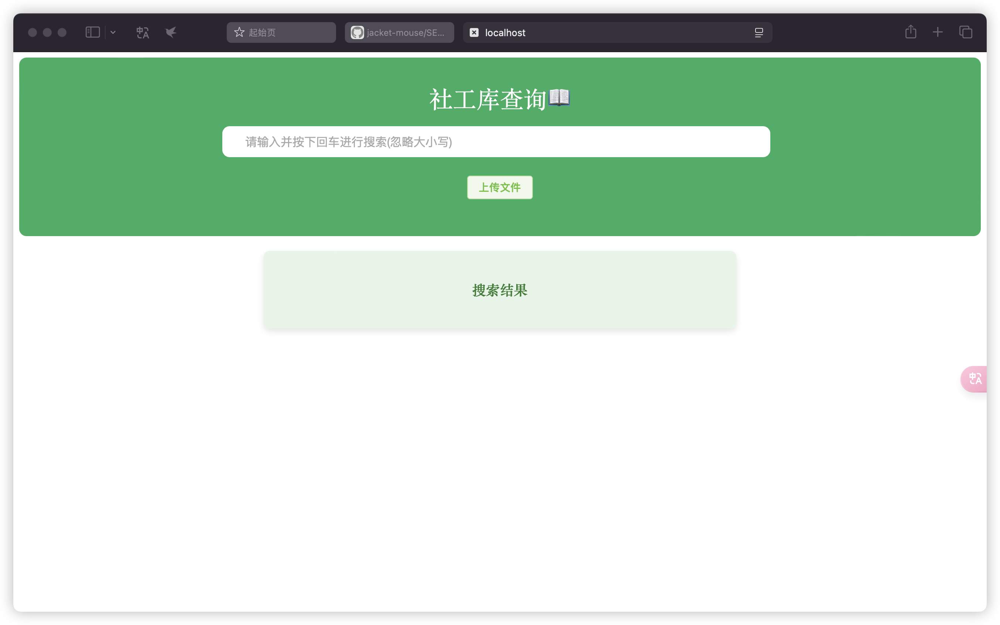

# 社工库项目
简易社工库--可以支持Excel、CSV、TXT文件的导入，自动创建索引，CSV和Excel文件自动导入数据库。

- 查询：主页面十分简洁，只有一个输入框，在其中输入想要查询的内容回车后就可以在下面输出结果中显示对应的结果。
- 文件上传：每次只能上传一个文件，文件类型包括：excel、csv、txt，上传的位置是在后端目录下相对应的文件类型文件夹下，例如：txt/、 csv/、xlsx/ 等。上传后会自动为该文件创建索引，csv文件和excel文件还会自动导入数据库，方便查询。



## 使用

确保你的电脑上有python和nodejs，若没有请先配置相应环境。

首先，将仓库clone到本地文件夹，进入backend文件夹中运行下面命令启动后端：

```shell
pip install -r requirements.txt
python app.py
```
然后打开frontend文件夹，运行下面命令，启动前端：

```shell
npm install
npm run dev
```

启动起来项目是无法直接查询的，需要先导入文件。

##  致谢

- Leezj9671的[socialdb_vue_flask](https://github.com/Leezj9671/socialdb_vue_flask)项目：我参考了其项目的前端设计。
